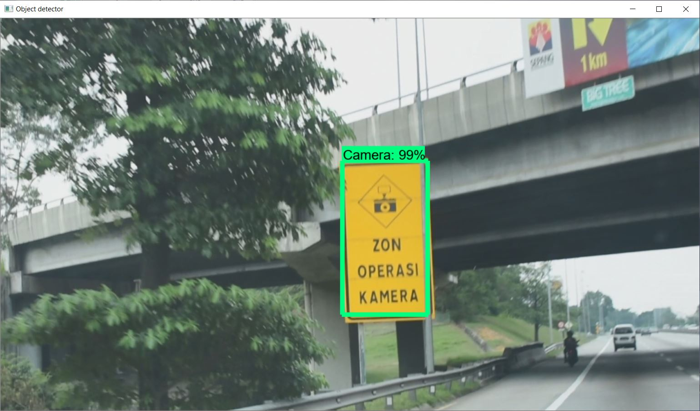
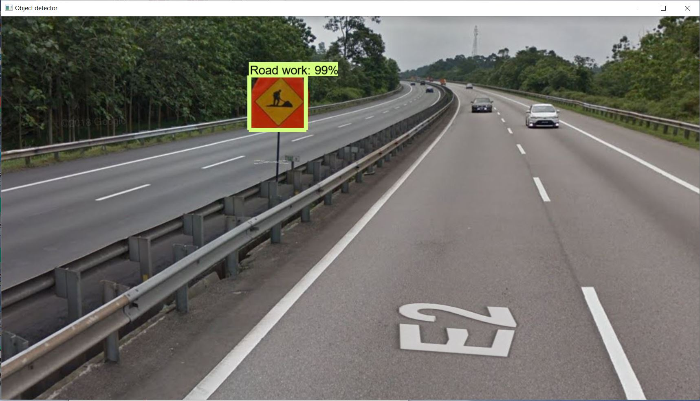

# Real-time on-road object detection using TensorFlow
This is part of the project I built for my Final Year Project during my undergraduate studies. This object detection model is trained to detect on-road objects such as pedestrian, vehicles, road-signs etc.

## Models used
During the research process, I trained 2 Single Shot MultiBox Detector (SSD) models and 1 Faster RCNN model. The training configuration are based on the official [TensorFlow Detection Model Zoo](https://github.com/tensorflow/models/blob/master/research/object_detection/g3doc/tf1_detection_zoo.md).

The outcome of the Faster RCNN model is pretty good in terms of accuracy, where the highest mean average precision (mAP) is 70% in optimal test environment.

